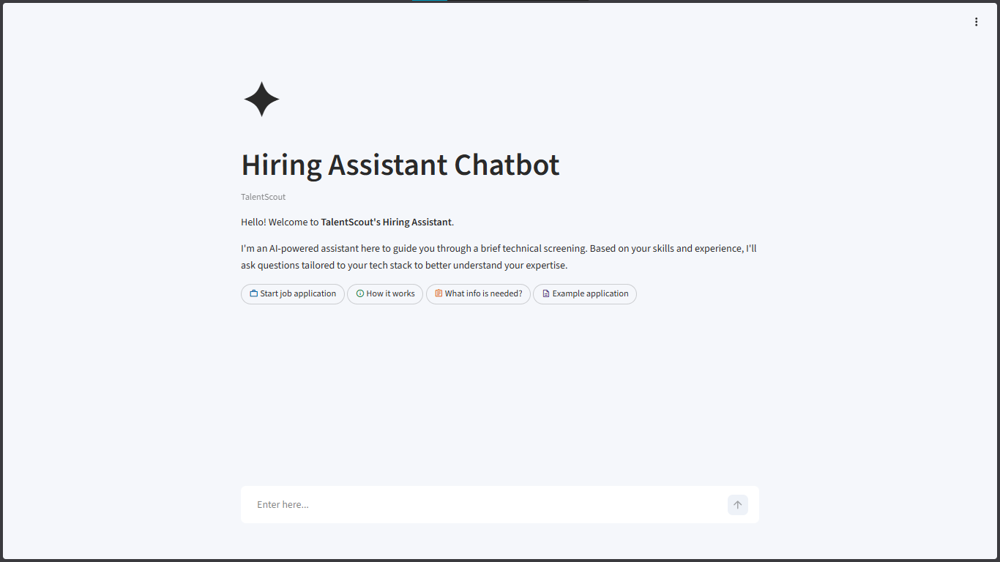

## Project Overview

The TalentScout Hiring Assistant Chatbot is a conversational app that uses AI to simplify the initial candidate screening process for a fictional recruitment agency, `TalentScout`. 

The chatbot interacts with candidates, gathers important information, and creates customized technical questions based on their tech stack. It uses AI Models (gpt-5-nano) to make sure conversations are intelligent, context aware, and responsive.

[Read docs](https://docs.google.com/document/d/e/2PACX-1vSP4tbsAIbF4pqt1gKeS2adWFtyzw-ceGEwOuxc4h_RhInFWLOZ2F6wHYKMiMf7FmUif2sDbcWxAqUW/pub) for more information.



## Installation

1. Clone the Repository: 
    ```bash 
    git clone https://github.com/Ankit6174/talentscout-hiring-assistant.git
    cd talentscout-hiring-assistant
    ```
    
2. Create Virtual Environment
    ```bash 
    uv venv venv
    source venv/bin/activate  # Mac/Linux
    venv\Scripts\activate     # Windows
    ```

3. Install Dependencies
    ```bash 
    uv sync
    ```

4. Set API Keys: 
    
    Create a .env file and add API_KEYS. See [.env.example](.env.example)

5. Run the Application
    ```bash 
    streamlit run main.py
    ```

## Tech Stack

| Category      | Technology                                                                                                                                                                                                                                             |
| ------------- | ------------------------------------------------------------------------------------------------------------------------------------------------------------------------------------------------------------------------------------------------------ |
| **Language** | 
| **UI**         |  |
| **AI Frameworks** |   
| **Model** |  |
| **Database** |                                                                                                                                          |
| **Deployment**|  

## Contributing
Contributions are welcome! Please open an issue or submit a pull request.

## Author

**Ankit Ahirwar**

* [Twitter](https://x.com/Ankit6174)
* [Medium](https://medium.com/@ankit6174)
* [LinkedIn](https://www.linkedin.com/in/Ankit6174) 